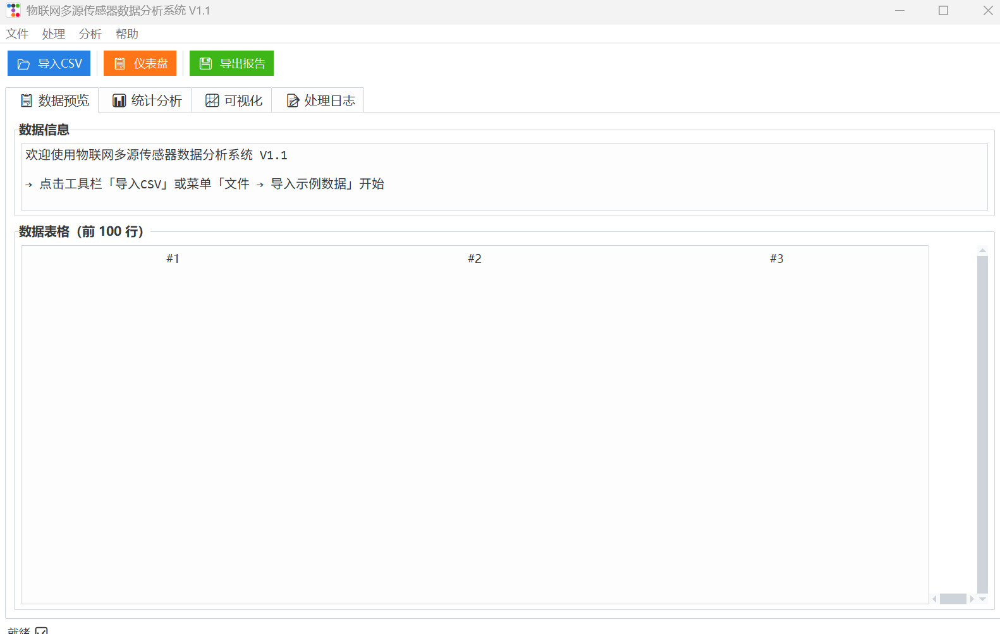
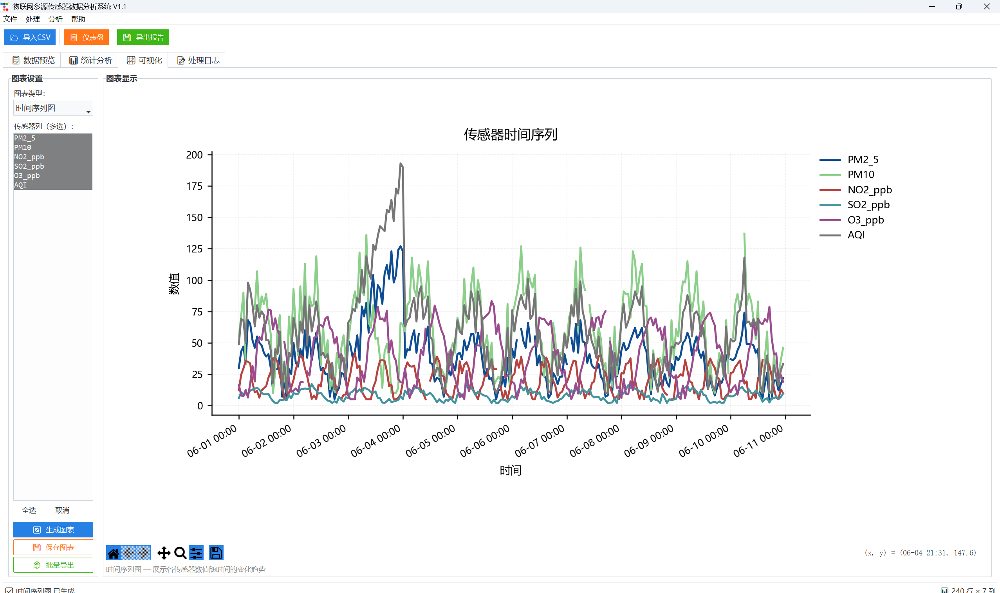
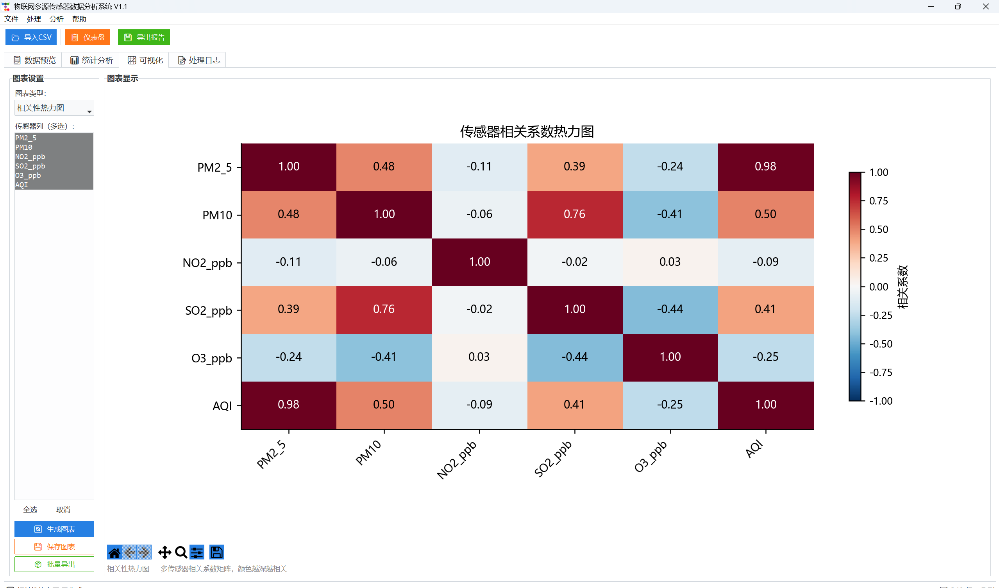
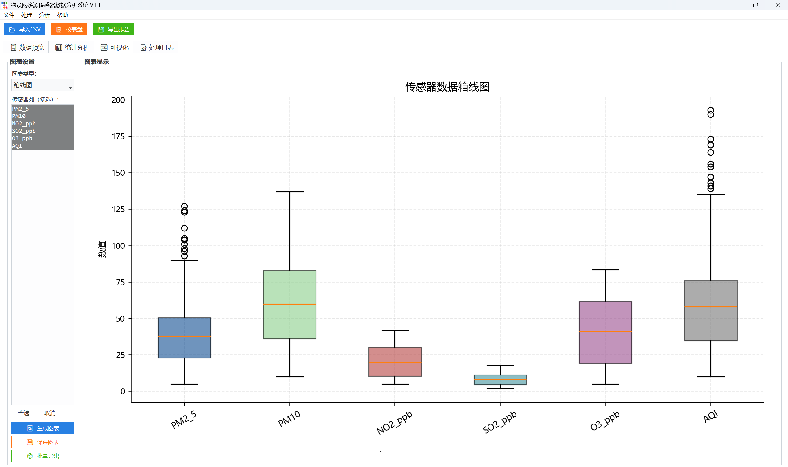

# 物联网多源传感器数据分析系统 V1.1

> 桌面端物联网传感器数据分析工具 — CSV/串口/MQTT 数据接入，6 种 Nature 期刊级图表，滞后互相关因果发现，一键导出分析报告。

[](https://python.org)
[](LICENSE)
[]()

📖 [English README](README_EN.md)

---

## ✨ 核心亮点

- **3 种数据源** — CSV 导入（自动编码识别）、串口（Arduino/ESP32）、MQTT 订阅
- **6 类图表** — Nature 期刊风格（Tufte 极简：去脊线、白底、色盲友好配色）
- **滞后互相关分析** — 发现传感器之间的时序因果关系
- **完整处理管线** — 缺失值填充(6种) → 异常检测(3σ+IQR) → 平滑(SMA+SG) → 分析
- **一键导出** — Excel 报告（含嵌入图表）+ 纯文本分析报告
- **免安装使用** — 提供 69MB Windows 安装包，无需安装 Python

---

## 🚀 快速开始

### 方式一：安装包（Windows）

从 [Releases](https://github.com/YOUR_USERNAME/iot-sensor-analysis/releases) 下载 `IoT_Sensor_Analyzer_V1.1_Setup.exe`，双击安装。

### 方式二：源码运行

```bash
git clone https://github.com/YOUR_USERNAME/iot-sensor-analysis.git
cd iot-sensor-analysis
pip install -r requirements.txt
python main.py
```

---

## 📊 图表展示

| | |
|---|---|
| **仪表盘** | **时序图** |
|  |  |
| **相关性热力图** | **箱线图** |
|  |  |

---

## 🔬 滞后互相关因果发现

本项目不止于静态相关性分析。`find_lagged_correlation()` 方法能发现传感器间的**时序因果关系**：

- 计算每对传感器在滞后窗口 [-T, T] 内的互相关
- 找到最优滞后量及对应相关系数
- 根据滞后方向构建因果关系有向图
- 通过监控图结构变化检测传感器故障

➡️ 完整论文见 `paper/` 目录（即将发布）

---

## 📦 示例数据

`samples/` 目录包含可直接使用的 CSV：

| 文件 | 场景 | 字段 |
|------|------|------|
| `sample_sensor_data.csv` | 多传感器仿真 | 温度, 湿度, 气压, 光照, 风速 |
| `室内环境监测.csv` | 室内环境 | 温度, 湿度, CO2, PM2.5 |
| `温室环境监测.csv` | 温室大棚 | 温度, 湿度, 光照, 土壤湿度 |
| `空气质量监测.csv` | 空气质量 | PM2.5, PM10, CO2, VOC |
| `设备振动监测.csv` | 工业设备 | 加速度X, 加速度Y, 加速度Z |

---

## 🔧 环境依赖

```
numpy>=1.24  pandas>=2.0  matplotlib>=3.7  scipy>=1.10
openpyxl>=3.1  ttkbootstrap>=1.10
```

可选（硬件接入）：
```
pyserial>=3.5  paho-mqtt>=1.6
```

---

## 📄 许可

MIT License — 详见 [LICENSE](LICENSE)

---

## 👤 作者

物联网工程本科在读，AI 方向考研备考中。

> 这行代码写于 2026 年夏天。从自学编程到写出第一个完整系统——每一步都在往前走。
